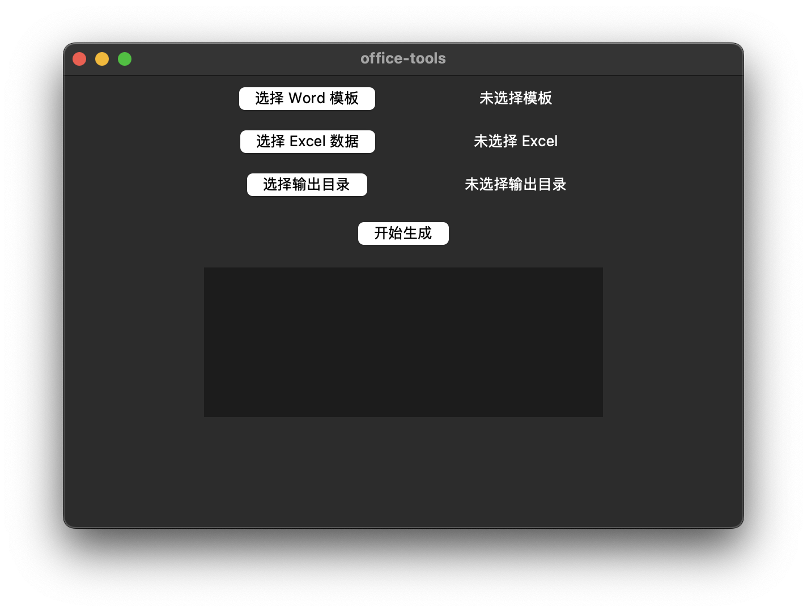
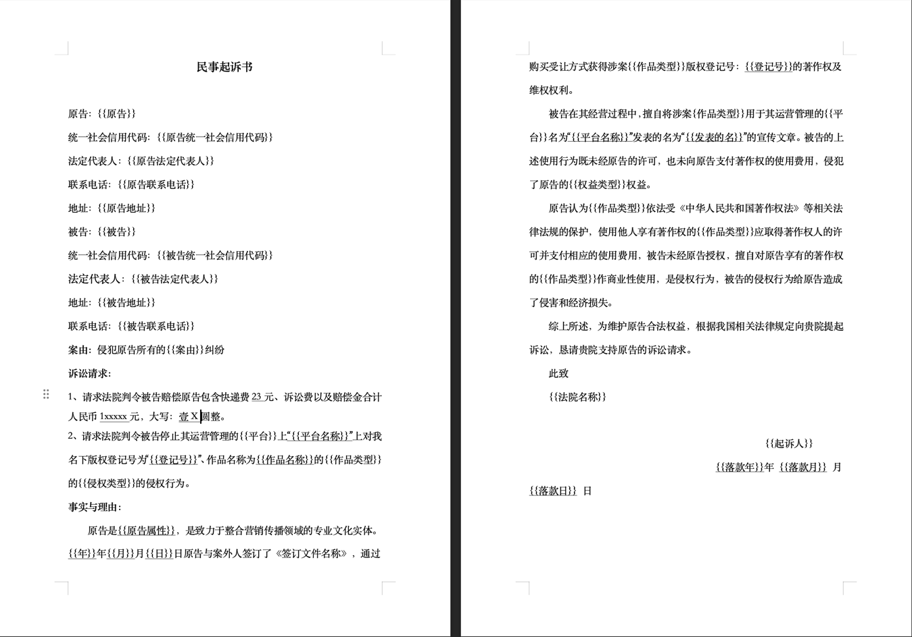
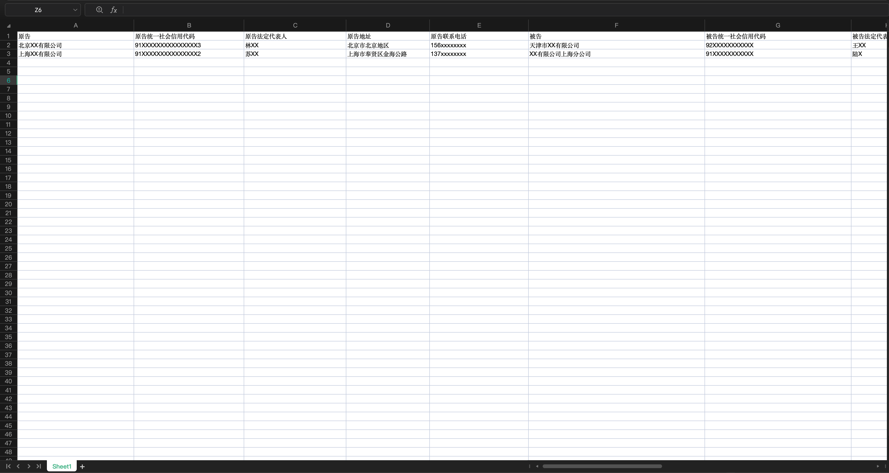
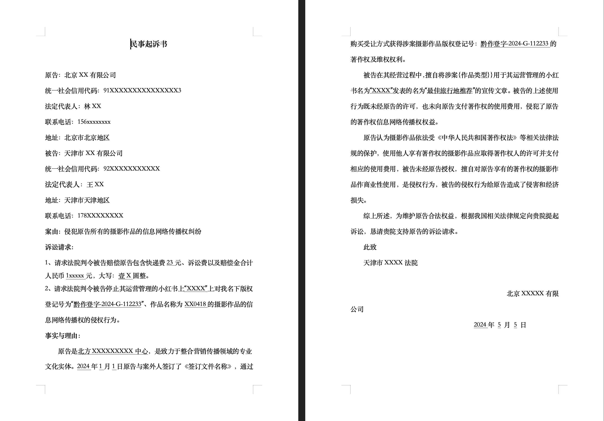

## Office-Tools

本项目使用 tkinter 构建图形界面，结合 `docxtpl`，`pandas`、`openpyxl` 等库，可以根据 Excel 数据以及 word 模板，批量生成与其对应的 Word 文档。通过 GUI，您可以方便地选择 Word 模板文件、Excel 数据源以及输出目录，一键进行批量文档输出。



## 功能

- 批量生成 Word：读取指定 Excel 中的所有数据行，每一行对应生成一个 Word 文件。
- 自定义模板变量：Excel 的列名与 Word 模板中 `{{ 变量名 }}` 对应。
- 文件名自动生成：如果 Excel 中包含“文件名”列，则以该列内容作为生成的 Word 文件名；否则将自动以 `output_序号` 命名。

## 如何安装

### step1 环境准备

- python 3.7+ with dependencies `pandas`, `docxtpl`, `pyinstaller`
- tcl-tk

```shell
brew install tcl-tk
pyenv install 3.12.9
pip install -r requirements
```

### step2 打包为 app 应用程序

```shell
cd office-tools
pyinstaller --noconfirm --windowed --name 'office-tools' main.py
```

### step3 安装

- 复制 `dist/office-tools.app` 到 `/Applications` 目录下
- 运行 `/Applications/office-tools.app` 

## 应用场景

> 以批量生成诉讼书为例

### step1 准备 word 模板

使用 `{{变量名}}` 表示占位符



### step2 准备 excel 数据

excel 列名即为 [word 模板](#step1-准备-word-模板) 的占位符



### step3 使用 APP 批量生成诉讼书(YouTube Overview)

[](https://www.youtube.com/watch?v=rkUPolQdI5k)


### step4 效果截图


